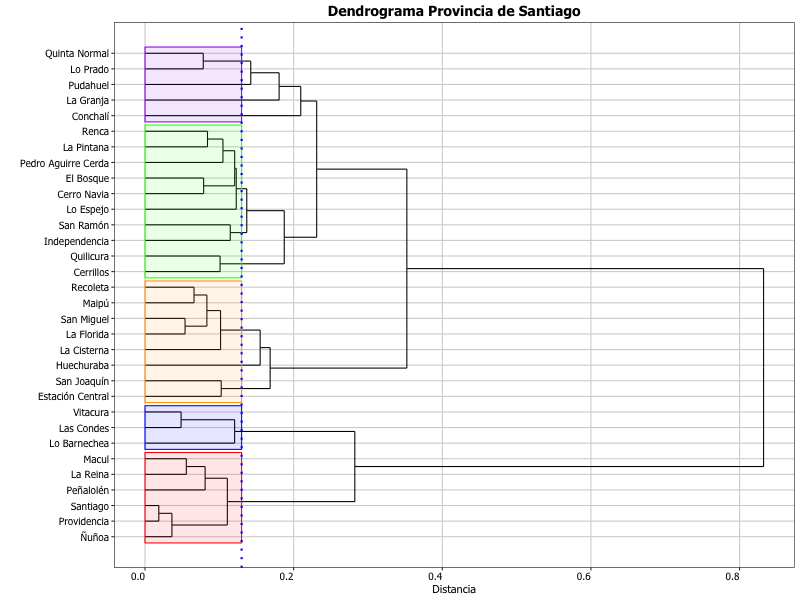

# Introducción

Lo que hacemos en [Constitución Abierta](www.constitucionabierta.cl) es tomar datos en bruto y a partir de ellos desarrollamos una plataforma de visualización de datos abiertos. 

Hemos explorado los datos y una vez que llegamos a entenderlos comenzamos a analizar patrones o tendencias que no se observan a simple vista. Hemos segmentado, dividido y agrupado los datos disponibles de las más diversas formas con el objetivo de poder comunicar resultados simples y fáciles de entender. 

Ante todo nos preguntamos ¿Cuál es la mejor manera de presentar nuestra información? Para esto hemos decido usar las mejores herramientas disponibles para presentar datos accesibles, esclarecedores y transparentes.

# El caso de Santiago.

Las comunas de Santiago, al igual que todas las comunas de Chile, tienen una caracterización demográfica y socio-económica que les dan características distintivas. 

¿Qué se puede decir respecto de las comunas de Santiago y lo que sus habitantes opinan respecto del proceso consultivo de reforma constitucional impulsado por el Gobierno? Hemos analizados los datos con el objetivo de generar grupos de comunas en base a los siete valores y conceptos mencionados en los ELAs y que resultan identitarios y separan a cada comuna de las demás.

Nuestro análisis, que incluye técnicas bastante recientes y las ya tradicionales, nos permite identificar valores y conceptos comunes entre las comunas de Santiago y formar grupos.

Tenemos los siguientes grupos de comunas:

## Grupo 1

Quinta Normal, Lo Prado, Pudahuel, La Granja y Conchalí.

## Grupo 2

Renca, La Pintana, Pedro Aguirre Cerda, El Bosque, Cerro Navia, Lo Espejo, San Ramón, Independencia, Quilicura y Cerrillos.

## Grupo 3

Recoleta, Maipú, San Miguel, La Florida, La Cisterna, Huechuraba, San Joaquín y Estación Central.

## Grupo 4

Vitacura, Las Condes y Lo Barnechea.

## Grupo 5

Macul, La Reina, Peñalolén, Santiago, Providencia y Ñuñoa.

## ¿Cómo se relacionan estos grupos?

El siguiente dendrograma muestra como se agrupan las comunas.

## ¿Cómo se obtuvo este resultado?

Como ya se mencionó, buscamos los valores y conceptos comunes entre las comunas de Santiago, siendo los siete más representativos de cada grupo los siguientes:

|Concepto|Grupo 1                            |Grupo 2                                      |Grupo3                                                          |Grupo4                                  |Grupo5                  |
|--------|-----------------------------------|---------------------------------------------|----------------------------------------------------------------|----------------------------------------|------------------------|
|1       |Cambio/Reforma Constitucional    |Dignidad                                     |Asamblea Constituyente                                          |Banco Central                           |Voto Obligatorio        |
|2       |Proteccion de los Derechos|Sindicalizarse y Negociación Colectiva|Estado Laico                                                    |Propiedad                               |Democracia Participativa|
|3       |Estado Laico                       |Cambio/Reforma Constitucional              |Sindicalizarse y Negociación Colectiva                   |Familia                                 |Asamblea Constituyente  |
|4       |Igualdad                           |Salud                                   |Régimen de Gobierno|Libre Empresa|Estado Laico            |
|5       |Defensor del Ciudadano      |Educación                               |Seguridad Social                                           |Tribunal Constitucional                 |Equidad                 |
