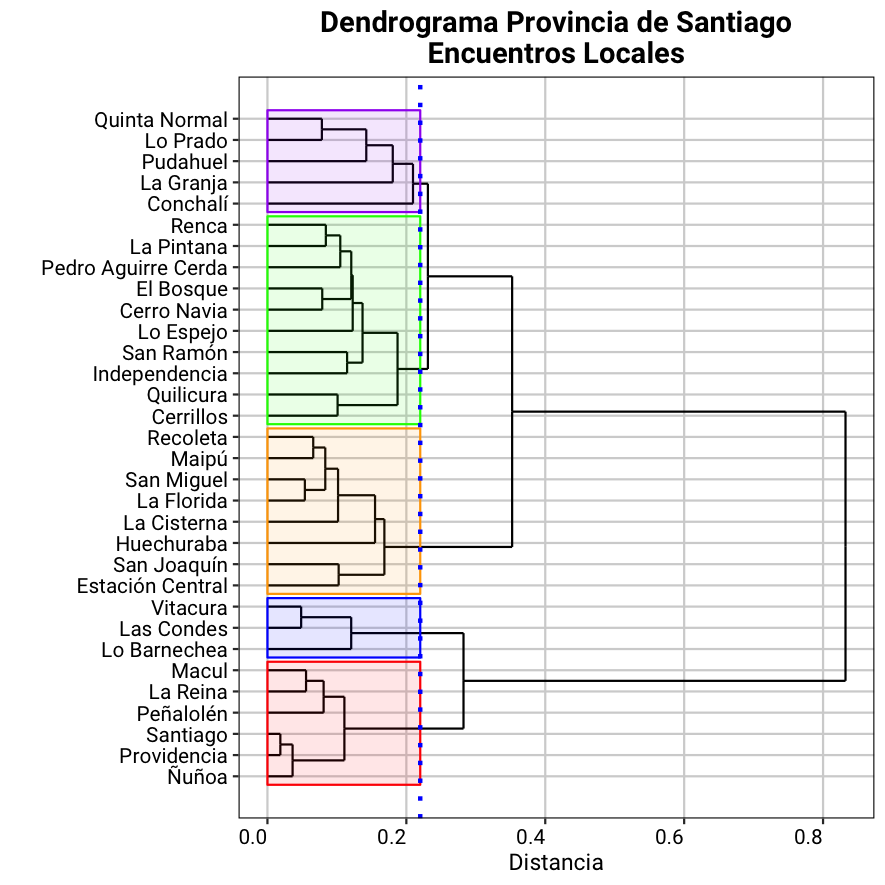
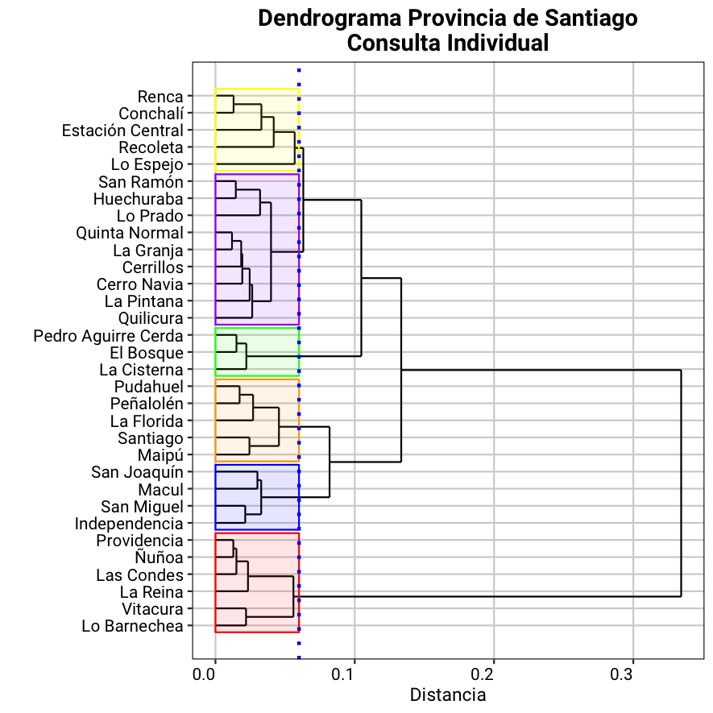

# Introducción

Lo que hacemos en [Constitución Abierta](www.constitucionabierta.cl) es tomar datos en bruto y a partir de ellos desarrollamos una plataforma de visualización de datos abiertos. 

Hemos explorado los datos y una vez que llegamos a entenderlos comenzamos a analizar patrones o tendencias que no se observan a simple vista. 

Lo que buscamos es presentar datos accesibles, esclarecedores y transparentes.

# El caso de Santiago.

Las comunas de Santiago, al igual que todas las comunas de Chile, tienen una caracterización demográfica y socio-económica que les dan características distintivas. 

Hemos analizados los datos con el objetivo de generar grupos de comunas en base a los valores y conceptos mencionados en los Encuentros Locales y Consulta Individual y que resultan identitarios y separan a cada comuna de las demás.

# Encuentros Locales 

Tomando todos los conceptos mencionados tenemos los siguientes grupos de comunas.

### Grupo 1

Quinta Normal, Lo Prado, Pudahuel, La Granja y Conchalí.

### Grupo 2

Renca, La Pintana, Pedro Aguirre Cerda, El Bosque, Cerro Navia, Lo Espejo, San Ramón, Independencia, Quilicura y Cerrillos.

### Grupo 3

Recoleta, Maipú, San Miguel, La Florida, La Cisterna, Huechuraba, San Joaquín y Estación Central.

### Grupo 4

Vitacura, Las Condes y Lo Barnechea.

### Grupo 5

Macul, La Reina, Peñalolén, Santiago, Providencia y Ñuñoa.

Los cinco conceptos más representativos de cada grupo los siguientes.

|Concepto|Grupo 1                      |Grupo 2                               |Grupo 3                               |Grupo 4                |Grupo 5                 |
|--------|-----------------------------|--------------------------------------|--------------------------------------|-----------------------|------------------------|
|1       |Cambio/Reforma Constitucional|Dignidad                              |Asamblea Constituyente                |Banco Central          |Voto Obligatorio        |
|2       |Protección de los Derechos   |Sindicalizarse y Negociación Colectiva|Estado Laico                          |Propiedad              |Democracia Participativa|
|3       |Estado Laico                 |Cambio/Reforma Constitucional         |Sindicalizarse y Negociación Colectiva|Familia                |Asamblea Constituyente  |
|4       |Igualdad                     |Salud                                 |Régimen de Gobierno                   |Libre Empresa          |Estado Laico            |
|5       |Defensor del Ciudadano       |Educación                             |Seguridad Social                      |Tribunal Constitucional|Equidad                 |

El siguiente dendrograma muestra como se agrupan las considerando todos los conceptos mencionados.

# Consulta Individual

Tomando todos los conceptos mencionados tenemos los siguientes grupos de comunas.

### Grupo 1

Renca, Conchalí, Estación Central, Recoleta y Lo Espejo.

### Grupo 2

San Ramón, Huechuraba, Lo Prado, Quinta Normal, La Granja, Cerillos, Cerro Navia, La Pintana y Quilicura.

### Grupo 3

Pedro Aguirre Cerda, El Bosque y La Cisterna.

### Grupo 4

Vitacura, Las Condes y Lo Barnechea.

### Grupo 5

Pudahuel, Peñalolén, La Florida, Santiago y Maipú.

### Grupo 6

San Joaquín, Macul, San Miguel e Independencia.

### Grupo 7

Providencia, Ñuñoa, La Reina, Vitacura y Lo Barnechea.

Los cinco conceptos más representativos de cada grupo los siguientes.

|Concepto|Grupo 1                        |Grupo 2                        |Grupo 3                        |Grupo 4                        |Grupo 5                                 |Grupo 6                 |
|--------|-------------------------------|-------------------------------|-------------------------------|-------------------------------|----------------------------------------|------------------------|
|1       |Familia de Padre, Madre e Hijos|Familia de Padre, Madre e Hijos|Familia de Padre, Madre e Hijos|Familia de Padre, Madre e Hijos|Salud                                   |Tribunal Constitucional |
|2       |Subsidiaridad                  |Subsidiaridad                  |Subsidiaridad                  |Derechos de los Animales       |Derechos Humanos                        |Banco Central           |
|3       |Libre Empresa                  |Salud                          |Libre Empresa                  |Asamblea Constituyente         |Educación                               |Derechos de los Animales|
|4       |Propiedad                      |Educación                      |Propiedad                      |Subsidiaridad                  |Protección/Conservación de la Naturaleza|Propiedad               |
|5       |Salud                          |Cumplimiento de Leyes y Normas |Emprendimiento Libre           |Salud                          |Asamblea Constituyente                  |Libre Empresa           |

El siguiente dendrograma muestra como se agrupan las considerando todos los conceptos mencionados.

